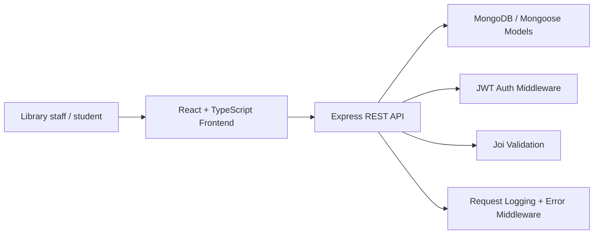

# ShelfLife System Design

## 1. Overview

ShelfLife is a library management platform for a college environment. It supports catalog management, member registration, borrowing, returns, and librarian-only transactions. The backend exposes REST endpoints and persists data in MongoDB using Mongoose models. The frontend is a Vite React application that allows a librarian to manage books, members, and borrowing workflows.

## 2. Architecture



## 3. Components

### Frontend
- Built with React + TypeScript + Vite.
- Provides login, book catalog display, member registration, and issue-book flows.
- Calls the backend using the Fetch API.

### Backend
- Express.js server runs the API.
- Mongoose schemas represent Book, Member, and BorrowRecord.
- JWT middleware protects issue and return routes.
- Validation and centralized error handling keep API responses consistent.

### Data layer
- MongoDB stores books, members, and borrow history.
- Unique indexes ensure ISBN, email, and membership ID are not duplicated.
- Atomic update logic prevents negative inventory values.

## 4. Borrowing workflow

1. Librarian authenticates with email and password.
2. A JWT is returned and attached to subsequent protected requests.
3. On book issue, the backend checks the book and member exist.
4. The backend runs a conditional stock decrement: availableCopies is only reduced when it is greater than zero.
5. The borrow record is created only after the stock update succeeds.
6. On return, the book is incremented back and the borrow status is marked as returned.

## 5. Race condition mitigation

The critical prevention mechanism is an atomic conditional update on the book stock:

```js
Book.findOneAndUpdate(
  { _id: bookId, availableCopies: { $gt: 0 } },
  { $inc: { availableCopies: -1 } },
  { new: true }
);
```

This prevents two librarians from issuing the last available copy at the same time because only one update can succeed when `availableCopies` is greater than zero. The other request sees no matching document and stops before the inventory goes negative.

## 6. Security and reliability

- JWT middleware protects library operations.
- Duplicate records are blocked with unique Mongoose indexes and explicit checks.
- Requests are validated with Joi before business logic runs.
- Centralized middleware produces consistent JSON responses.

## 7. Future enhancements

- Add admin roles and librarian management.
- Add overdue job automation and notifications.
- Add search filters and sorting for large catalog datasets.
- Add tests for API edge cases and concurrency scenarios.
